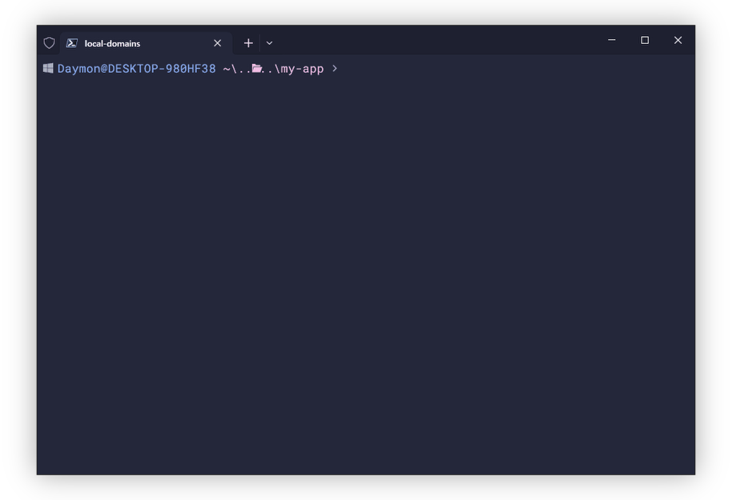

<p align="center">

</p>

<br>

> Create and manage virtual domains on the fly for easier local development.


---

<br>

## Demo


## Installation

Install vidos with npm

```bash
  npm install -g vidos
```
## Overview

vidos (short for _virtual domains_) allows you to create/manage server blocks (otherwise known as virtual domains) on the fly with
next to no setup required; allowing you to route any domain to any IP.

While this could be utilized for a variety of things, the primary intention is to
assist in local web development. Instead of needing to use some form of a toggle or enviornment variable
to switch between `127.0.0.1` and your prod domain, you can instead let vidos map your
prod domain to your localhost; allowing you to focus more on a production equivalent
environment, and less on making sure all your links and callbacks are pointing
to the right domain.

## How

Behind the scenes, vidos creates an entry in your hosts file for your domain, and 
a config file for mapping it through nginx. If you don't have nginx already, vidos can
download and manage a copy for you.

## Features

### Local Domains

- Create and delete domain mappings on the fly through the `vidos` command line
- Enable or disable a given domain at any time

### Config file

- Local JSON file for configurations
- Synchronisation between the local config file and your hosts/nginx files
- Optionally refresh your local server automatically whenever you make changes to the config file;
either manually or automatically through other `vidos` commands
- Specify a custom folder for domain configurations to live under in your server files
- Use a custom hosts file

### Local Server

- Automatically `download` and manage a nginx instance for your server
  - Or use your own (existing) nginx instance
- `start` and `stop` at any given point; restoring your hosts file and nginx configuration
to what it was before
- Easily `refresh` a server whenever you make manual config file changes
- `kill` existing nginx instances, should something go wrong


## Getting Started

Kick off your vidos usage with the `init` or `install` command

```bash
vidos init
```




## Roadmap

- CI Testing
- Backups
- SSL
- Complete *nix support
- Migrate to Kotlin/JS (maybe)

## License

[Apache 2.0](/LICENSE)

